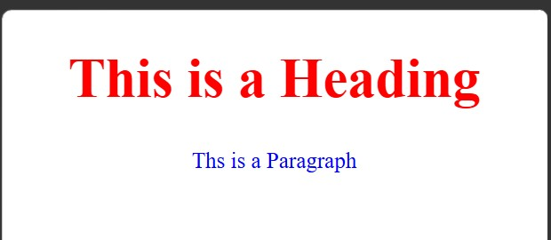

<div align="center">

# 🚀 CSS Learning Portfolio

### Building My Full Stack Development Journey, One Lesson at a Time.


<br><br>

<a href="https://github.com/mr-nexora">

</a

<a href="https://www.linkedin.com/in/mrnexora/">

</a>

<a href="https://mr-nexora.github.io/mr-nexora-personal-portfolio/">

</a>

</div>

---

# 👋 Welcome

Welcome to my **CSS Learning Repository**.

This repository showcases my journey of learning modern CSS, including layouts, Flexbox, Grid, animations, responsive design, and UI styling. Each lesson contains source code, notes, screenshots, and practical exercises to improve my front-end development skills.

---

# 📂 Repository Overview

| 📌 Information | Details |
|:---------------|:--------|
| 👨‍💻 Author | **T.M.S.U. Thennakoon (Sahan Udara)** |
| 🎓 Program | Computer Science Undergraduate |
| 💻 Technology | CSS3 |
| 📚 Learning Method | Daily Lessons & Hands-on Practice |
| 🎯 Goal | Become a Professional Full Stack Developer |
| 📅 Repository Started | 2026 |

---

# ✨ What's Inside

- 📖 Structured Lessons
- 💻 Source Code
- 📷 Output Screenshots
- 📝 Markdown Notes
- 🚀 Mini Projects
- 📚 Practice Exercises
- 📈 Continuous Progress Updates

---

# 🌍 Connect With Me

<div align="center">

<a href="https://github.com/mr-nexora">

</a>

<a href="https://www.linkedin.com/in/mrnexora/">

</a>

<a href="https://mr-nexora.github.io/mr-nexora-personal-portfolio/">

</a>

</div>

---

# 📚 Learning Resources

This repository is built through continuous practice using educational resources such as:

- W3Schools
- MDN Web Docs
- freeCodeCamp


---

# ⚖️ Copyright

> **© 2026 T.M.S.U. Thennakoon (Sahan Udara). All Rights Reserved.**
>
> This repository has been created for educational, portfolio, and personal learning purposes.
>
> You are welcome to explore the code and learn from it. However, copying, redistributing, or presenting this work as your own without permission is not allowed.

---
<div align="center">

⭐ If you find this repository useful, consider giving it a Star.

Happy Coding! 🚀

</div>

# Lesson 02: CSS Syntax & Anatomy of a Rule-set

Understanding CSS syntax is the foundation of writing clean, error-free stylesheets. This module breaks down how a CSS rule is structured and examines how styles are applied to HTML elements.

---

## 1. CSS Syntax

A CSS rule-set consists of a **selector** and a **declaration block**. The selector points to the HTML element you want to style, and the declaration block contains one or more declarations that define the styles.

### The Anatomy of a CSS Rule
Every CSS rule follows a strict structural anatomy:

* **Selector:** The HTML element name at the start of the CSS block (e.g., `h1`, `p`).
* **Declaration Block:** Everything enclosed within the curly braces `{ }`.
* **Declaration:** A single line inside the curly braces consisting of a **Property** and a **Value**.
* **Property:** The style attribute you want to change (e.g., `color`, `text-align`, `font-size`).
* **Value:** The specific setting assigned to the property (e.g., `red`, `center`, `20px`).

Each declaration must end with a semicolon (`;`), and declaration blocks must be surrounded by curly braces (`{ }`).

---

## 2. Code Implementation Example

Below is a practical implementation showing how CSS syntax is used inside an HTML document using internal styling (`<style>` tags).

```CSS
    /* test.html */
    <style>
        h1 {
            color: red;
            text-align: center;
        }
        p {
            color: blue;
            text-align: center;
        }
    </style>
```
#### 
---