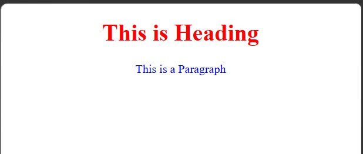
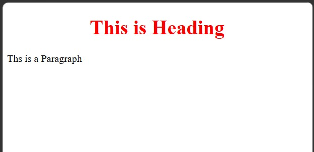
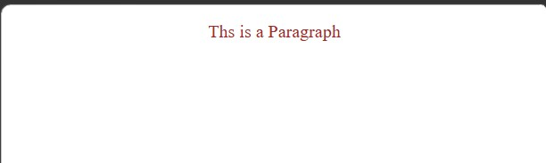
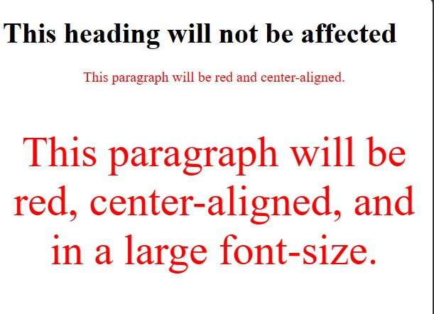
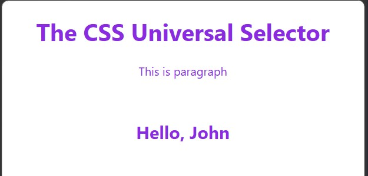
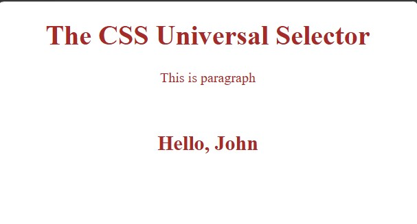

<div align="center">

# 🚀 CSS Learning Portfolio

### Building My Full Stack Development Journey, One Lesson at a Time.


<br><br>

<a href="https://github.com/mr-nexora">

</a>

<a href="https://www.linkedin.com/in/mrnexora/">

</a>

<a href="https://mr-nexora.github.io/mr-nexora-personal-portfolio/">

</a>

</div>

---

# 👋 Welcome

Welcome to my **CSS Learning Repository**.

This repository showcases my journey of learning modern CSS, including layouts, Flexbox, Grid, animations, responsive design, and UI styling. Each lesson contains source code, notes, screenshots, and practical exercises to improve my front-end development skills.

---

# 📂 Repository Overview

| 📌 Information | Details |
|:---------------|:--------|
| 👨‍💻 Author | **T.M.S.U. Thennakoon (Sahan Udara)** |
| 🎓 Program | Computer Science Undergraduate |
| 💻 Technology | CSS3 |
| 📚 Learning Method | Daily Lessons & Hands-on Practice |
| 🎯 Goal | Become a Professional Full Stack Developer |
| 📅 Repository Started | 2026 |

---

# ✨ What's Inside

- 📖 Structured Lessons
- 💻 Source Code
- 📷 Output Screenshots
- 📝 Markdown Notes
- 🚀 Mini Projects
- 📚 Practice Exercises
- 📈 Continuous Progress Updates

---

# 🌍 Connect With Me

<div align="center">

<a href="https://github.com/mr-nexora">

</a>

<a href="https://www.linkedin.com/in/mrnexora/">

</a>

<a href="https://mr-nexora.github.io/mr-nexora-personal-portfolio/">

</a>

</div>

---

# 📚 Learning Resources

This repository is built through continuous practice using educational resources such as:

- W3Schools
- MDN Web Docs
- freeCodeCamp


---

# ⚖️ Copyright

> **© 2026 T.M.S.U. Thennakoon (Sahan Udara). All Rights Reserved.**
>
> This repository has been created for educational, portfolio, and personal learning purposes.
>
> You are welcome to explore the code and learn from it. However, copying, redistributing, or presenting this work as your own without permission is not allowed.

---
<div align="center">

⭐ If you find this repository useful, consider giving it a Star.

Happy Coding! 🚀

</div>

# Lesson 03: CSS Selectors

CSS selectors are used to "find" or select the HTML elements you want to style. Understanding how to target elements precisely allows you to write clean, effective, and optimized stylesheets.

---

## 1. The CSS Element Selector

The **element selector** (also known as the tag selector) selects HTML elements based on their tag name. All elements of the specified type on the webpage will share the same styles.

```CSS
    /* test.html */
    <style>
        h1 {
            color: red;
            text-align: center;
        }
        p {
            color: blue;
            text-align: center;
        }
    </style>
```

#### 

---

## 2. The CSS ID Selector

The ID selector uses the id attribute of an HTML element to select a specific, unique element on the page. Since an ID must be unique within a page, this selector is used to style one single element.

**Syntax: Write a hash (#) character, followed by the ID name of the element.**

Rule: An ID name cannot start with a number.

```CSS
    /* test2.html */
    <style>
        #heading {
            color: red;
            text-align: center;
        }
     </style>
```

#### 

---

## 3. The CSS Class Selector

The class selector selects HTML elements with a specific class attribute. Unlike IDs, a class name can be used on multiple elements across the same page.

**Syntax: Write a period (.) character, followed by the class name.**

_Example 01:_ Standard Class Selector
Applies the styles to any HTML element that has class="mycls".

```CSS
    /* Eg: 01 | test3.html */
     <style>
        .mycls {
            color: brown;
            text-align: center;
        }
     </style>
```

#### 

_Example 02:_ Targeting Specific Elements with a Class
You can specify that only specific HTML elements should be affected by a class.

```CSS
    /* Eg: 02 | test4.html */
     <style>
        h1.mycls {
            color: red;
            font-size: 50px;
            text-align: center;
        }
        p.mycls {
            color: blue;
            font-size: 20px;
            text-align: center;
        }
     </style>
```

#### 

_Example 03:_ Multiple Classes on HTML Elements
HTML elements can refer to more than one class (e.g., <p class="center large">). In CSS, you define each class independently.

```CSS
    /* Eg: 03 | test5.html */
    <style>
        p.center {
            text-align: center;
            color: red;
        }

        p.large {
            font-size: 300%;
        }
    </style>
```

#### 

---

# CSS Grouping Selectors

## 4. CSS Universal Selector

The universal selector (\*) selects all HTML elements on the entire webpage.

Common Use: Used for global resets, setting default fonts, or applying baseline margins and paddings across all elements.

```CSS
    /* test6.html */
    <style>
        * {
            color:blueviolet;
            text-align: center;
            font-family: 'Segoe UI', Tahoma, Geneva, Verdana, sans-serif;
        }
    </style>
```

#### 

---

## 5. CSS Grouping Selector

The grouping selector selects all HTML elements with the same style definitions, allowing you to write cleaner code without repeating yourself (DRY Principle - Don't Repeat Yourself).

Syntax: Separate each selector name with a comma (,).

```CSS
    /* test7.html */
    <style>
        h1,h2,p {
            color: brown;
            text-align: center;
            }
    </style>
```

#### 

---
