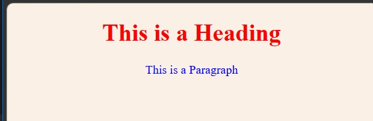
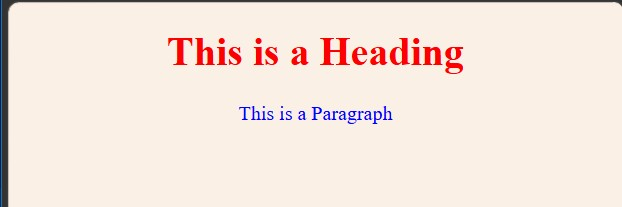
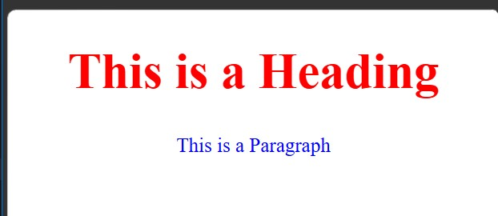
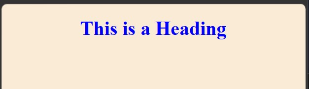
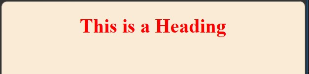

<div align="center">

# 🚀 CSS Learning Portfolio

### Building My Full Stack Development Journey, One Lesson at a Time.


<br><br>

<a href="https://github.com/mr-nexora">

</a>

<a href="https://www.linkedin.com/in/mrnexora/">

</a>

<a href="https://yourportfolio.com">

</a>

</div>

---

# 👋 Welcome

Welcome to my **CSS Learning Repository**.

This repository showcases my journey of learning modern CSS, including layouts, Flexbox, Grid, animations, responsive design, and UI styling. Each lesson contains source code, notes, screenshots, and practical exercises to improve my front-end development skills.

---

# 📂 Repository Overview

| 📌 Information | Details |
|:---------------|:--------|
| 👨‍💻 Author | **T.M.S.U. Thennakoon (Sahan Udara)** |
| 🎓 Program | Computer Science Undergraduate |
| 💻 Technology | CSS3 |
| 📚 Learning Method | Daily Lessons & Hands-on Practice |
| 🎯 Goal | Become a Professional Full Stack Developer |
| 📅 Repository Started | 2026 |

---

# ✨ What's Inside

- 📖 Structured Lessons
- 💻 Source Code
- 📷 Output Screenshots
- 📝 Markdown Notes
- 🚀 Mini Projects
- 📚 Practice Exercises
- 📈 Continuous Progress Updates

---

# 🌍 Connect With Me

<div align="center">

<a href="https://github.com/mr-nexora">

</a>

<a href="https://www.linkedin.com/in/mrnexora/">

</a>

<a href="https://yourportfolio.com">

</a>

</div>

---

# 📚 Learning Resources

This repository is built through continuous practice using educational resources such as:

- W3Schools
- MDN Web Docs
- freeCodeCamp


---

# ⚖️ Copyright

> **© 2026 T.M.S.U. Thennakoon (Sahan Udara). All Rights Reserved.**
>
> This repository has been created for educational, portfolio, and personal learning purposes.
>
> You are welcome to explore the code and learn from it. However, copying, redistributing, or presenting this work as your own without permission is not allowed.

---
<div align="center">

⭐ If you find this repository useful, consider giving it a Star.

Happy Coding! 🚀

</div>

---
# Lesson 04: How To Add CSS

There are three ways to insert CSS into an HTML document: **External CSS**, **Internal CSS**, and **Inline CSS**. Understanding when and how to use each method—along with how browsers handle multiple stylesheets—is essential for web development.

---

## 1. External CSS

With an external stylesheet, you write all your CSS in a separate file (usually with a `.css` extension) and link it inside the HTML `<head>` section using the `<link>` tag.

- **Best For:** Styling entire multi-page websites.
- **Advantage:** Changes made in a single `.css` file update the appearance of the entire website.

```CSS
    /* test1.html */
    <!DOCTYPE html>
    <html>
    <head>
        <title>Test1</title>

        <!-- External CSS -->
        <link rel="stylesheet" href="css/style.css">

    </head>
    <body>

        <h1>This is a Heading</h1>
        <p>This is a Paragraph</p>

    </body>
    </html>
```

#### 

---

## 2. Internal CSS

An internal stylesheet is defined inside the <style> element within the <head> section of an HTML page.

Best For: Single-page websites or unique styles specific to a single HTML document.

Advantage: Styles are kept within the same document, eliminating the need to load an extra CSS file.

```CSS
    /* test2.html */
    <style>
        body {
            background-color: linen;
        }

        h1 {
            color: red;
            text-align: center;
        }

        p {
            color: blue;
            text-align: center;
        }
    </style>
```

#### 

---

## 3. Inline CSS

Inline CSS is applied directly to a specific HTML element using the style attribute.

Best For: Quick testing or applying a quick, unique style to a single element.

Disadvantage: Mixes content with presentation, making code hard to maintain and read.

```CSS
    /* test3.html */
    <!DOCTYPE html>
    <html>
    <head>
        <title>Test3</title>
    </head>
    <body>

        <!-- Inline CSS -->
        <h1 style="color: red; text-align: center; font-size: 50px;">This is a Heading</h1>
        <p style="color: blue;text-align: center; font-size: 20px;">This is a Paragraph</p>

    </body>
    </html>
```

#### 

---

## 4. Multiple Style Sheets & Cascading Order

When multiple style definitions exist for an HTML element, styles will cascade into a new "virtual" stylesheet based on priority rules.

Generally, the rule that is defined last in the HTML document (or has higher specificity) will override previous rules.

### Case A: External Sheet Linked AFTER Internal Style

In this setup, if css/test4.css contains a rule for h1, it will override the internal style because the external stylesheet link appears after the <style> tag in the source code.

```CSS
    /* test4.html */
    <!DOCTYPE html>
    <html>
    <head>
        <title>Test4</title>

        <!-- Multiple Style Sheets -->
        <style>
            h1 {
                color: red;
            }
        </style>

        <link rel="stylesheet" href="css/test4.css">

    </head>
    <body>

        <h1>This is a Heading</h1>

    </body>
    </html>
```

#### 

---

### Case B: Internal Style Defined AFTER External Sheet

In this setup, the internal <style> block appears after the external stylesheet link. Therefore, the internal color: red; rule will override whatever color rule was specified inside css/test4.css.

```CSS
    /* test5.html */
    <!DOCTYPE html>
    <html>
    <head>
        <title>Test4</title>

        <!-- Multiple Style Sheets -->
        <link rel="stylesheet" href="css/test4.css">

        <style>
            h1 {
                color: red;
            }
        </style>

    </head>
    <body>

        <h1>This is a Heading</h1>

    </body>
    </html>
```

#### 
