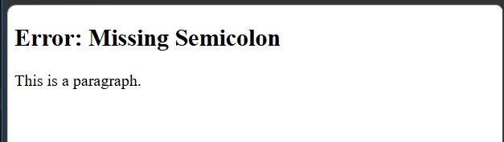
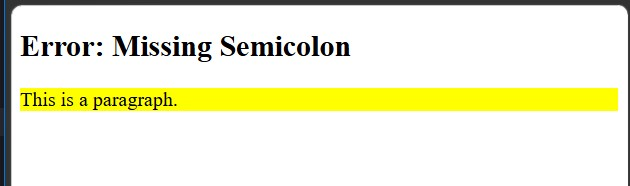
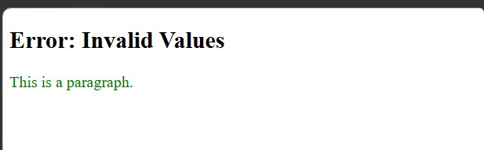
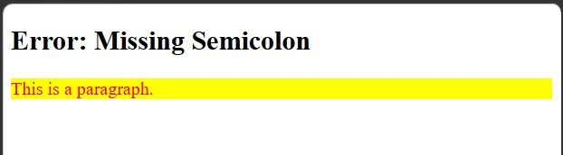
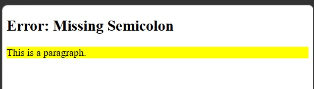

<div align="center">

# 🚀 CSS Learning Portfolio

### Building My Full Stack Development Journey, One Lesson at a Time.


<br><br>

<a href="https://github.com/mr-nexora">

</a>

<a href="https://www.linkedin.com/in/mrnexora/">

</a>

<a href="https://mr-nexora.github.io/mr-nexora-personal-portfolio/">

</a>

</div>

---

# 👋 Welcome

Welcome to my **CSS Learning Repository**.

This repository showcases my journey of learning modern CSS, including layouts, Flexbox, Grid, animations, responsive design, and UI styling. Each lesson contains source code, notes, screenshots, and practical exercises to improve my front-end development skills.

---

# 📂 Repository Overview

| 📌 Information | Details |
|:---------------|:--------|
| 👨‍💻 Author | **T.M.S.U. Thennakoon (Sahan Udara)** |
| 🎓 Program | Computer Science Undergraduate |
| 💻 Technology | CSS3 |
| 📚 Learning Method | Daily Lessons & Hands-on Practice |
| 🎯 Goal | Become a Professional Full Stack Developer |
| 📅 Repository Started | 2026 |

---

# ✨ What's Inside

- 📖 Structured Lessons
- 💻 Source Code
- 📷 Output Screenshots
- 📝 Markdown Notes
- 🚀 Mini Projects
- 📚 Practice Exercises
- 📈 Continuous Progress Updates

---

# 🌍 Connect With Me

<div align="center">

<a href="https://github.com/mr-nexora">

</a>

<a href="https://www.linkedin.com/in/mrnexora/">

</a>

<a href="https://mr-nexora.github.io/mr-nexora-personal-portfolio/">

</a>

</div>

---

# 📚 Learning Resources

This repository is built through continuous practice using educational resources such as:

- W3Schools
- MDN Web Docs
- freeCodeCamp


---

# ⚖️ Copyright

> **© 2026 T.M.S.U. Thennakoon (Sahan Udara). All Rights Reserved.**
>
> This repository has been created for educational, portfolio, and personal learning purposes.
>
> You are welcome to explore the code and learn from it. However, copying, redistributing, or presenting this work as your own without permission is not allowed.

---
<div align="center">

⭐ If you find this repository useful, consider giving it a Star.

Happy Coding! 🚀

</div>

---

# Lesson 06: Common CSS Errors & Debugging

When writing CSS, even a small syntax error can cause entire rule-sets or layout components to fail silently. Unlike programming languages that throw runtime errors, browsers simply ignore invalid CSS declarations.

This module explores the most common CSS errors, how browsers parse them, and how to fix them.

---

## 1. Missing Semicolon

Every CSS declaration inside a declaration block must end with a semicolon (`;`). If a semicolon is omitted, the browser attempts to merge the declaration with the next line, causing both properties to break.

- **Issue:** `color: red` lacks a trailing semicolon.
- **Result:** The browser parses it as `color: red background-color: yellow;` which is invalid CSS.

```css
    /* test1.html */
    <style>
        p.bad {
            color: red
            background-color: yellow;
        }
    </style>
```

#### 

---

## 2. Invalid Property Names

CSS properties must be spelled correctly according to the W3C specification. Typographical errors in property names cause the browser to completely ignore that specific declaration.

- **Issue:** colr is used instead of color.

- **Result:** The browser skips colr: red and moves on to the next property.

```css
    /* test2.html */
    <style>
        p.bad {
            colr: red /* color */
            background-color: yellow;
        }
    </style>
```

#### 

---

## 3. Invalid Values

Passing values that are logically or syntactically invalid for a given CSS property causes the browser to reject that specific declaration.

- **Issue:** Negative values (e.g., -100px) assigned to properties like width or height are invalid in standard CSS layout contexts.

- **Result:** The width property is ignored, but valid properties (like color: green;) will still apply.

```CSS
    /* test3.html */
    <style>
        p.bad {
            width: -100px;
            color: green;
        }
    </style>
```

#### 

---

## 4. Unclosed Braces

Opening curly braces ({) define the start of a declaration block, and closing curly braces (}) define the end. Failing to close a block causes the CSS parser to read subsequent rules as part of the unclosed block, leading to cascading stylesheet failure.

- **Issue:** Missing closing brace } at the end of the rule-set.

- **Result:** Breaks parsing for this selector and all selectors defined after it.

```CSS
    /* test4.html */
    <style>
        p.bad {
            color: red;
            background-color: yellow;

    </style>
```

#### 

---

## 5. Extra Colons or Braces

Punctuation errors, such as doubling colons (::) or adding extra braces, break the strict key-value formatting required by the CSS parser.

- **Issue:** Using double colons (::) between property and value (color:: red;). Note: While :: is valid for CSS pseudo-elements (like ::before), it is invalid inside key-value declarations.

- **Result:** The browser cannot parse the property-value pair and ignores the declaration.

```CSS
    /* test5.html */
    <style>
        p.bad {
            color:: red;
            background-color: yellow;
        }
    </style>
```

#### 
