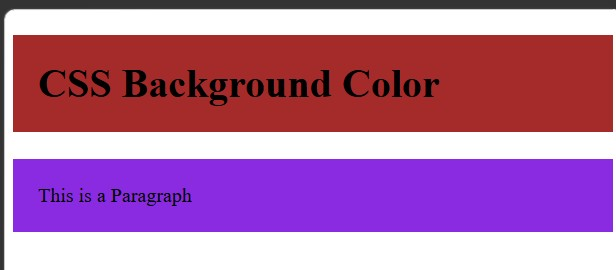
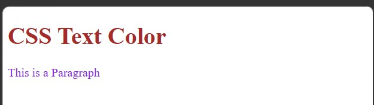
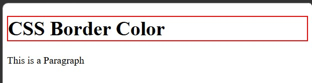

<div align="center">

# 🚀 CSS Learning Portfolio

### Building My Full Stack Development Journey, One Lesson at a Time.


<br><br>

<a href="https://github.com/mr-nexora">

</a>

<a href="https://www.linkedin.com/in/mrnexora/">

</a>

<a href="https://mr-nexora.github.io/mr-nexora-personal-portfolio/">

</a>

</div>

---

# 👋 Welcome

Welcome to my **CSS Learning Repository**.

This repository showcases my journey of learning modern CSS, including layouts, Flexbox, Grid, animations, responsive design, and UI styling. Each lesson contains source code, notes, screenshots, and practical exercises to improve my front-end development skills.

---

# 📂 Repository Overview

| 📌 Information        | Details                                    |
| :-------------------- | :----------------------------------------- |
| 👨‍💻 Author             | **T.M.S.U. Thennakoon (Sahan Udara)**      |
| 🎓 Program            | Computer Science Undergraduate             |
| 💻 Technology         | CSS3                                       |
| 📚 Learning Method    | Daily Lessons & Hands-on Practice          |
| 🎯 Goal               | Become a Professional Full Stack Developer |
| 📅 Repository Started | 2026                                       |

---

# ✨ What's Inside

- 📖 Structured Lessons
- 💻 Source Code
- 📷 Output Screenshots
- 📝 Markdown Notes
- 🚀 Mini Projects
- 📚 Practice Exercises
- 📈 Continuous Progress Updates

---

# 🌍 Connect With Me

<div align="center">

<a href="https://github.com/mr-nexora">

</a>

<a href="https://www.linkedin.com/in/mrnexora/">

</a>

<a href="https://mr-nexora.github.io/mr-nexora-personal-portfolio/">

</a>

</div>

---

# 📚 Learning Resources

This repository is built through continuous practice using educational resources such as:

- W3Schools
- MDN Web Docs
- freeCodeCamp

---

# ⚖️ Copyright

> **© 2026 T.M.S.U. Thennakoon (Sahan Udara). All Rights Reserved.**
>
> This repository has been created for educational, portfolio, and personal learning purposes.
>
> You are welcome to explore the code and learn from it. However, copying, redistributing, or presenting this work as your own without permission is not allowed.

---

<div align="center">

⭐ If you find this repository useful, consider giving it a Star.

Happy Coding! 🚀

## </div>

---

# Lesson 07: CSS Colors & Color Values

Colors play a crucial role in web design, enhancing user interface (UI) aesthetics and visual hierarchy. CSS provides multiple ways to apply colors using property declarations and various color formats like Named Colors, RGB, HEX, and HSL.

---

## 1. CSS Background Color

The color property is used to set the text color of an HTML element.
You can set the background color for HTML elements using the `background-color` property.

```CSS
     <h1 style="background-color: brown; padding: 20px;">CSS Background Color</h1>
     <p style="background-color:blueviolet; padding: 20px;">This is a Paragraph</p>
```

#### 

---

## 2. CSS Text Color

The color property is used to set the text color of an HTML element.

```CSS
     <h1 style="color: brown;">CSS Background Color</h1>
     <p style="color:blueviolet;">This is a Paragraph</p>
```

#### 

---

## 3. CSS Border Color

You can set the color of element borders using the border shorthand property or border-color.

```CSS
     <h1 style="border: 2px solid red;">CSS Border Color</h1>
     <p style="border: 2px soild blue;">This is a Paragraph</p>
```

#### 

---

## 4. CSS RGB Colors

An RGB color value represents RED, GREEN, and BLUE light sources.

- **Syntax:** rgb(red, green, blue)

Each parameter defines the intensity of the color as an integer between 0 and 255.

rgb(255, 0, 0) is pure Red, rgb(0, 255, 0) is pure Green, and rgb(0, 0, 255) is pure Blue.

RGBA (With Opacity)
You can also use rgba(red, green, blue, alpha) where the alpha parameter specifies the opacity (transparency) from 0.0 (fully transparent) to 1.0 (fully opaque).

```css
/* RGB Examples */
h1 {
  color: rgb(165, 42, 42); /* Brown */
}

p {
  background-color: rgba(138, 43, 226, 0.5); /* Blueviolet with 50% opacity */
}
```

## 5. CSS HEX Colors

A HEX color is specified with a hexadecimal value using six digits prefixed with a hash (#).

- **Syntax:** #RRGGBB

RR (Red), GG (Green), and BB (Blue) are hexadecimal values between 00 and FF (0–255 in decimal).

#FF0000 is Red, #00FF00 is Green, and #0000FF is Blue.

```css
/* HEX Examples */
h1 {
  color: #a52a2a; /* Brown */
}

p {
  background-color: #8a2be2; /* Blueviolet */
}
```

## 6. CSS HSL Colors

HSL stands for Hue, Saturation, and Lightness. It offers an intuitive, human-friendly way to adjust color tones and shades.

- **Syntax:** hsl(hue, saturation, lightness)

Hue: A degree on the color wheel from 0 to 360. (0 is Red, 120 is Green, 240 is Blue).

Saturation: A percentage value (0% is gray/monochrome, 100% is full color).

Lightness: A percentage value (0% is black, 50% is normal, 100% is white).

HSLA (With Opacity)
Similar to RGBA, hsla(hue, saturation, lightness, alpha) allows you to define an alpha channel for transparency.

```css
/* HSL Examples */
h1 {
  color: hsl(0, 59%, 41%); /* Brown shade */
}

p {
  background-color: hsla(271, 76%, 53%, 0.8); /* Blueviolet with 80% opacity */
}
```
