<div align="center">

# 🚀 CSS Learning Portfolio

### Building My Full Stack Development Journey, One Lesson at a Time.


<br><br>

<a href="https://github.com/mr-nexora">

</a>

<a href="https://www.linkedin.com/in/mrnexora/">

</a>

<a href="https://yourportfolio.com">

</a>

</div>

---

# 👋 Welcome

Welcome to my **CSS Learning Repository**.

This repository showcases my journey of learning modern CSS, including layouts, Flexbox, Grid, animations, responsive design, and UI styling. Each lesson contains source code, notes, screenshots, and practical exercises to improve my front-end development skills.

---

# 📂 Repository Overview

| 📌 Information | Details |
|:---------------|:--------|
| 👨‍💻 Author | **T.M.S.U. Thennakoon (Sahan Udara)** |
| 🎓 Program | Computer Science Undergraduate |
| 💻 Technology | CSS3 |
| 📚 Learning Method | Daily Lessons & Hands-on Practice |
| 🎯 Goal | Become a Professional Full Stack Developer |
| 📅 Repository Started | 2026 |

---

# ✨ What's Inside

- 📖 Structured Lessons
- 💻 Source Code
- 📷 Output Screenshots
- 📝 Markdown Notes
- 🚀 Mini Projects
- 📚 Practice Exercises
- 📈 Continuous Progress Updates

---

# 🌍 Connect With Me

<div align="center">

<a href="https://github.com/mr-nexora">

</a>

<a href="https://www.linkedin.com/in/mrnexora/">

</a>

<a href="https://yourportfolio.com">

</a>

</div>

---

# 📚 Learning Resources

This repository is built through continuous practice using educational resources such as:

- W3Schools
- MDN Web Docs
- freeCodeCamp


---

# ⚖️ Copyright

> **© 2026 T.M.S.U. Thennakoon (Sahan Udara). All Rights Reserved.**
>
> This repository has been created for educational, portfolio, and personal learning purposes.
>
> You are welcome to explore the code and learn from it. However, copying, redistributing, or presenting this work as your own without permission is not allowed.

---
<div align="center">

⭐ If you find this repository useful, consider giving it a Star.

Happy Coding! 🚀

</div>

---
# Lesson 08: CSS Backgrounds

CSS background properties are used to define the background effects for HTML elements. They allow you to apply colors, images, control image repetition, set positioning, and create fixed or scrolling background layouts.

---

## 1. CSS background-color

The `background-color` property sets the background color of an element. Colors can be defined using color names, RGB/RGBA values, or HEX values.

```CSS
    /* test1.html */
    <style>
        body {
            background-color: antiquewhite;
        }
        h1 {
            background-color:rgb(245, 106, 26) ;
        }
        h3 {
            background-color: rgb(255, 253, 119);
        }
        .section {
            background-color: rgb(255, 231, 176);
        }
    </style>
```

#### 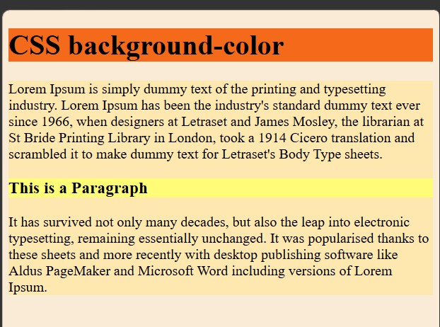

---

## 2. Opacity / Transparency

The `opacity property` specifies the transparency of an element. It takes a value from `0.0` (fully transparent) to `1.0` (fully opaque).

### Important Note:

When using the opacity property to add transparency to an element's background, all of its child elements (including text) inherit the same opacity and become transparent as well.

```CSS
    /* test2.html */
    <style>
        .op1 {
            background-color: aquamarine;
            padding: 4%;
            opacity: 0.1;
        }
        .op2 {
            background-color: aquamarine;
            padding: 4%;
            opacity: 0.3;
        }
        .op3 {
            background-color: aquamarine;
            padding: 4%;
            opacity: 0.6;
        }
        .op4 {
            background-color: aquamarine;
            padding: 4%;
            opacity: 0.9;
        }
    </style>
```

#### 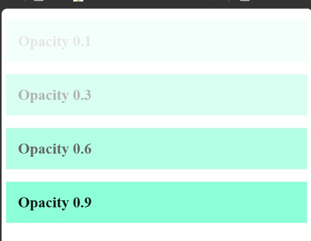

---

## 3. Transparency using RGBA

If you do not want to apply opacity to child elements (such as text inside the container), use RGBA color values. The 4th parameter (alpha) controls the background transparency without affecting text inside the container.

```CSS
    /* test3.html */
    <style>
        .op1 {
            background: rgb(0, 128, 0);
            opacity: 0.1;
        }

        .op2 {
            background: rgba(0, 128, 0, 0.1);
            opacity: 0.3;
        }

        .op3 {
            background: rgba(0, 128, 0, 0.3);
            opacity: 0.6;
        }

        .op4 {
            background: rgba(0, 128, 0, 0.6);
            opacity: 1.0;
        }
    </style>
```

#### 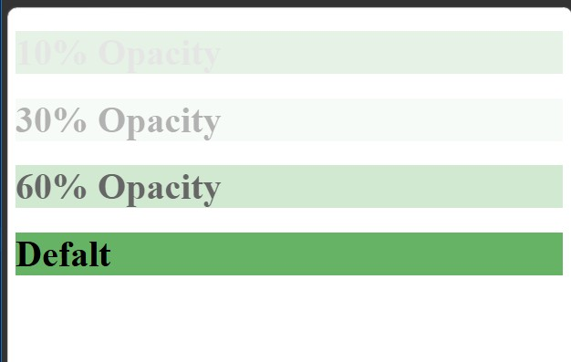

---

## 4. CSS Background Image

The background-image property specifies an image to use as the background of an element. By default, the image is repeated so it covers the entire element.

```CSS
    /* test4.html */
    <style>
        body {
            background-image: url(images/bg.jpg);
        }
        h1 {
            color: white;
        }
    </style>
```

#### 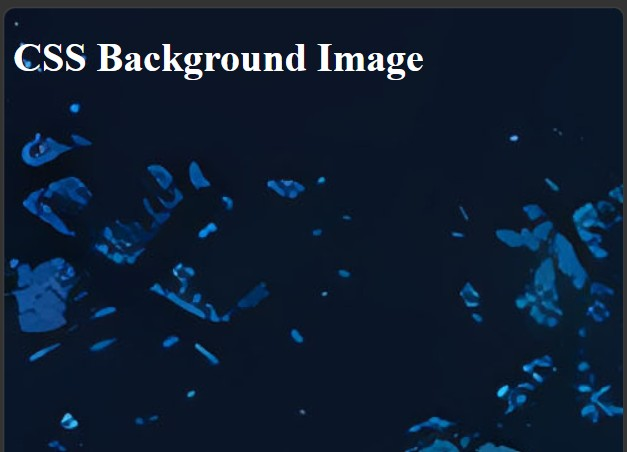

---

## 5. CSS Background Image Repeat

By default, `background-image repeats` both horizontally and vertically to cover the entire page container.

```CSS
    /* test5.html */
    <style>
        body {
            background-image: url("images/gradient_bg.jpg");
        }
    </style>
```

#### 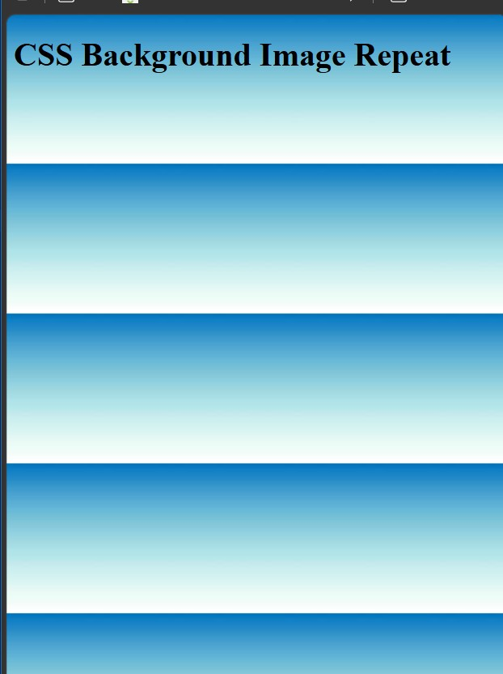

---

## 6. CSS background-repeat Horizontally

To repeat a `background image only horizontally` (along the X-axis), set background-repeat: repeat-x;.

```CSS
    /* test6.html */
    <style>
        body {
            background-image: url("images/gradient_bg.jpg");
            background-repeat:repeat-x ;
        }
    </style>
```

#### 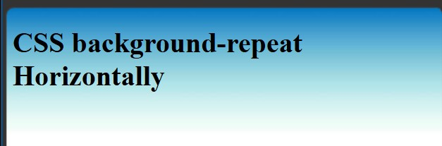

---

## 7. CSS background-repeat Vertically

To repeat a background image only vertically (along the Y-axis), set `background-repeat: repeat-y;`.

```CSS
    /* test7.html */
    <style>
        body {
            background-image: url("images/gradient_bg.jpg");
            background-repeat:repeat-y ;
        }
    </style>
```

#### 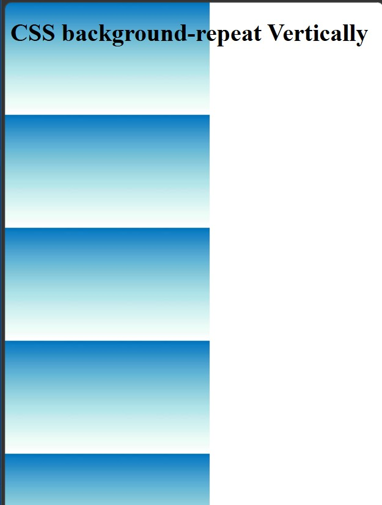

---

## 8. CSS background-repeat: no-repeat

Showing a background image only once requires setting `background-repeat: no-repeat;`.

```CSS
    /* test8.html */
    <style>
        body {
            background-image: url(images/fairy.jpg);
            background-repeat: no-repeat;
        }
    </style>
```

#### 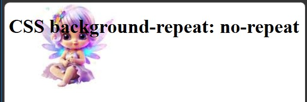

---

## 9. CSS background-position

The background-position property defines the starting position of a non-repeating background image (e.g., `top right`, `center`, `bottom left`, or `pixel/percentage offsets`).

```CSS
    /* test9.html */
    <style>
        body {
            background-image: url(images/fairy.jpg);
            background-repeat: no-repeat;
            background-position: right top;
        }
    </style>
```

#### 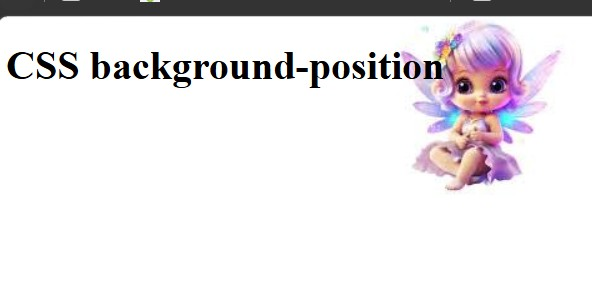

---

## 10. CSS Background Attachment

The `background-attachment` property sets whether a background image is fixed within the viewport or scrolls along with the rest of the page.

### The image remains fixed in place on the screen even when the user scrolls down the webpage.

```CSS
    /* text.10.html */
    <style>
        body {
            background-image: url(images/fairy.jpg);
            background-repeat: no-repeat;
            background-position: right top;
            background-attachment:fixed;
        }
    </style>
```

#### 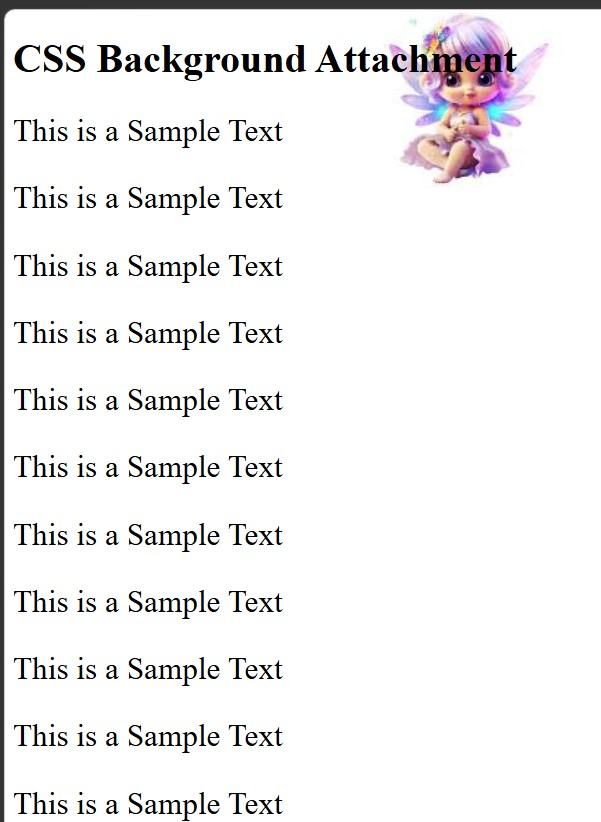

---

### B. Scrolling Background (background-attachment: scroll)

The background image scrolls along with the page content (This is the default browser behavior).

```CSS
    /* text.11.html */
    <style>
        body {
            background-image: url(images/fairy.jpg);
            background-repeat: no-repeat;
            background-position: right top;
            background-attachment:scroll;
        }
    </style>
```

#### 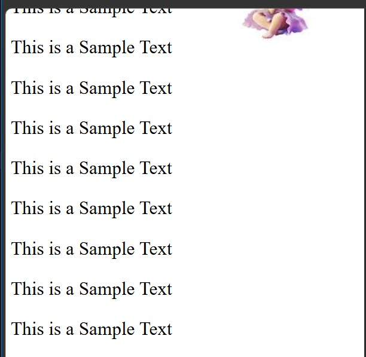

---

## 11. CSS Background Shorthand

To shorten background property declarations, you can combine multiple individual properties into one single declaration using the background shorthand property.

### Allowed Property Order:

- 1. background-color
- 2. background-image
- 3. background-repeat
- 4. background-attachment
- 5. background-position

```CSS
    /* test12.html */
    <style>
        body {
            background: #ffffff url("images/fairy.jpg") no-repeat right top;
            margin-right: 200px;
        }
    </style>
```
x
#### 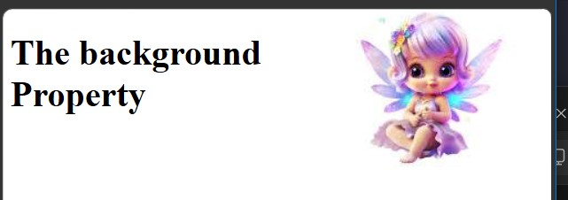
