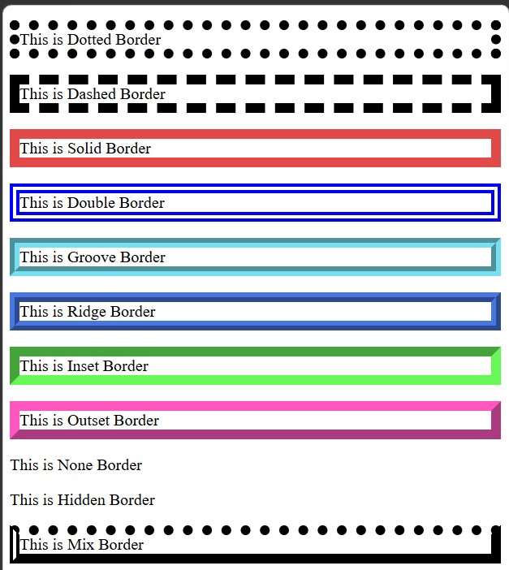
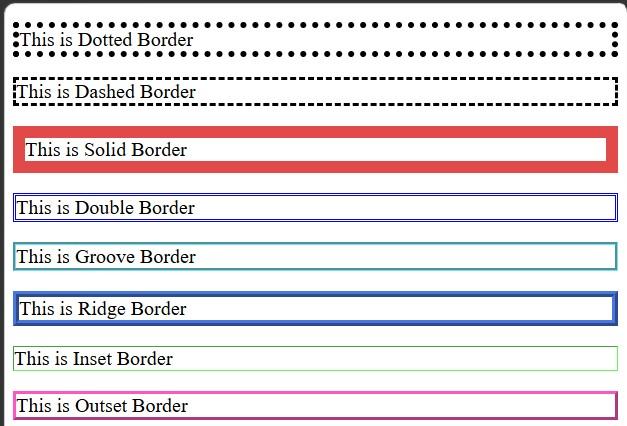
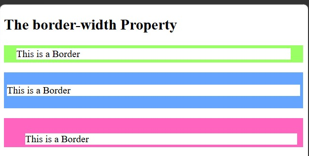
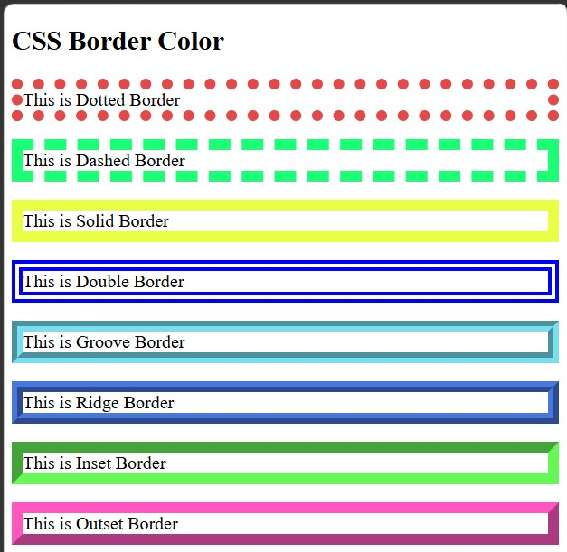
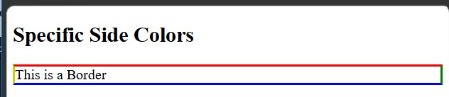
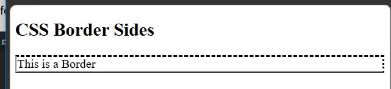
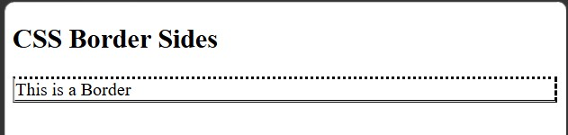
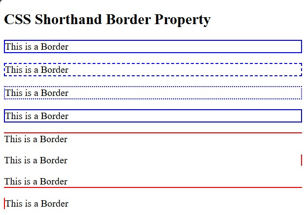
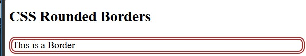

<div align="center">

# 🚀 CSS Learning Portfolio

### Building My Full Stack Development Journey, One Lesson at a Time.


<br><br>

<a href="https://github.com/mr-nexora">

</a>

<a href="https://www.linkedin.com/in/mrnexora/">

</a>

<a href="https://mr-nexora.github.io/mr-nexora-personal-portfolio/">

</a>

</div>

---

# 👋 Welcome

Welcome to my **CSS Learning Repository**.

This repository showcases my journey of learning modern CSS, including layouts, Flexbox, Grid, animations, responsive design, and UI styling. Each lesson contains source code, notes, screenshots, and practical exercises to improve my front-end development skills.

---

# 📂 Repository Overview

| 📌 Information | Details |
|:---------------|:--------|
| 👨‍💻 Author | **T.M.S.U. Thennakoon (Sahan Udara)** |
| 🎓 Program | Computer Science Undergraduate |
| 💻 Technology | CSS3 |
| 📚 Learning Method | Daily Lessons & Hands-on Practice |
| 🎯 Goal | Become a Professional Full Stack Developer |
| 📅 Repository Started | 2026 |

---

# ✨ What's Inside

- 📖 Structured Lessons
- 💻 Source Code
- 📷 Output Screenshots
- 📝 Markdown Notes
- 🚀 Mini Projects
- 📚 Practice Exercises
- 📈 Continuous Progress Updates

---

# 🌍 Connect With Me

<div align="center">

<a href="https://github.com/mr-nexora">

</a>

<a href="https://www.linkedin.com/in/mrnexora/">

</a>

<a href="https://mr-nexora.github.io/mr-nexora-personal-portfolio/">

</a>

</div>

---

# 📚 Learning Resources

This repository is built through continuous practice using educational resources such as:

- W3Schools
- MDN Web Docs
- freeCodeCamp


---

# ⚖️ Copyright

> **© 2026 T.M.S.U. Thennakoon (Sahan Udara). All Rights Reserved.**
>
> This repository has been created for educational, portfolio, and personal learning purposes.
>
> You are welcome to explore the code and learn from it. However, copying, redistributing, or presenting this work as your own without permission is not allowed.

---
<div align="center">

⭐ If you find this repository useful, consider giving it a Star.

Happy Coding! 🚀

</div>

---
# Lesson 09: CSS Borders

The CSS `border` properties allow you to specify the style, width, color, and border radius (rounded corners) of an element's border.

---

## 1. CSS Border Styles

The `border-style` property specifies what kind of border to display.

> **Crucial Rule:** No border properties will have any effect unless the `border-style` property is set!

Allowed values for `border-style` include:

- `dotted` - Defines a dotted border
- `dashed` - Defines a dashed border
- `solid` - Defines a solid border
- `double` - Defines a double border
- `groove` - Defines a 3D grooved border
- `ridge` - Defines a 3D ridged border
- `inset` - Defines a 3D inset border
- `outset` - Defines a 3D outset border
- `none` - Defines no border
- `hidden` - Defines a hidden border

```CSS
    /* test1.html */
    <style>

        .p1 {
            border: 10px dotted;
        }
        .p2 {
            border: 10px dashed;
        }
        .p3 {
            border: 10px solid #e24949;
        }
        .p4 {
            border: 10px double blue;
        }
        .p5 {
            border: 10px groove rgb(118, 223, 241);
        }
        .p6 {
            border: 10px ridge #4977e2;
        }
        .p7 {
            border: 10px inset #67f857;
        }
        .p8 {
            border: 10px outset #ff57bf;
        }
        .p9 {
            border: 10px none;
        }
        .p10 {
            border: 10px hidden;
        }
        .p11 {
            border: 10px;
            border-style: dotted dashed solid double;
        }
    </style>
```

#### 

---

## 2. CSS Border Width

The `border-width` property specifies the thickness of the four borders.

Width can be set using specific measurements (e.g., `px, pt, cm, em`) or by using one of the three pre-defined keywords: `thin`, `medium`, or `thick`.

```CSS
    /* test2.html */
    <style>

        .p1 {
            border: 10px dotted;
            border-width: 5px;
        }
        .p2 {
            border: 10px dashed;
            border-width: medium;
        }
        .p3 {
            border: 10px solid #e24949;
        }
        .p4 {
            border: 10px double blue;
            border-width: inherit;
        }
        .p5 {
            border: 10px groove rgb(118, 223, 241);
            border-width:initial;
        }
        .p6 {
            border: 10px ridge #4977e2;
            border-width:thick;
        }
        .p7 {
            border: 10px inset #67f857;
            border-width:thin;
        }
        .p8 {
            border: 10px outset #ff57bf;
            border-width:unset;
        }
    </style>
```

#### 

---

## 3. Specific Side Widths (Multi-Value Syntax)

The `border-width` property can take one to four values (Clockwise order: Top, Right, Bottom, Left):

- 4 Values: `border-width: 25px 10px 4px 35px;` (Top: 25px, Right: 10px, Bottom: 4px, Left: 35px)

- 2 Values: `border-width: 5px 20px;` (Top/Bottom: 5px, Left/Right: 20px)

- 1 Value: `border-width: 10px;` (All 4 sides: 10px)

```CSS
    /* test3.html */
    <style>
        p.one {
            border: solid #99ff65;
            border-width: 5px 20px; /* 5px top and bottom, 20px on the sides */
        }

        p.two {
            border: solid #65a5ff;
            border-width: 20px 5px; /* 20px top and bottom, 5px on the sides */
        }

        p.three {
            border: solid #ff65bf;
            border-width: 25px 10px 4px 35px; /* 25px top, 10px right, 4px bottom and 35px left */
        }
    </style>
```

#### 

---

## 4. CSS Border Color

The `border-color` property is used to set the color of the four borders using Color Names, HEX values, RGB/RGBA values, or HSL values.

```CSS
    /* test4.html */
    <style>
        .p1 {
            border: 10px dotted;
            border-color: #e24949;
        }
        .p2 {
            border: 10px dashed;
            border-color: rgb(26, 255, 118);
        }
        .p3 {
            border: 10px solid;
            border-color: #e9ff45;
        }
        .p4 {
            border: 10px double ;
            border-color: blue;
        }
        .p5 {
            border: 10px groove ;
            border-color: rgb(118, 223, 241);
        }
        .p6 {
            border: 10px ridge ;
            border-color: #4977e2;
        }
        .p7 {
            border: 10px inset ;
            border-color: #67f857;
        }
        .p8 {
            border: 10px outset ;
            border-color: #ff57bf;
        }
    </style>
```

#### 

---

## 5. Specific Side Colors

Just like `border-width`, `border-color` can also accept up to four values in clockwise order (Top, Right, Bottom, Left).

```CSS
    /* test5.html */
    <style>
        p {
            border-style: solid;
            border-color: red green blue rgb(207, 207, 5); /* red top, green right, blue bottom and yellow left */
        }
    </style>
```

#### 

---

## 6. CSS Border Sides

In CSS, there are also individual properties for specifying each border side (`top`, `right`, `bottom`, `left`).

Individual Property Approach:

```CSS
    /* test6.html */
    <style>
    p {
        border-top-style: dashed;
        border-right-style: dotted;
        border-bottom-style: double;
        border-left-style: groove;
    }
    </style>
```

#### 

```CSS
    /* test7.html */
    <style>
        p {
            border-style: dotted dashed double groove;
        }
    </style>
```

#### 

---

## 7. CSS Shorthand Border Property

Instead of writing individual properties for width, style, and color, you can combine them into a single border property declaration.

Syntax:
`border: [border-width] [border-style] [border-color];`

You can also target specific individual sides with shorthand properties: `border-top`, `border-right`, `border-bottom`, `border-left`.

```CSS
    <style>
        .p1 {
            border: 2px solid blue;
        }
        .p2 {
            border: 2px dashed blue;
        }
        .p3 {
            border: 2px dotted blue;
        }
        .p4 {
            border: 2px groove blue;
        }
        .p5 {
            border-top: 2px solid red;
        }
        .p6 {
            border-right: 2px solid red;
        }
        .p7 {
            border-bottom: 2px solid red;
        }
        .p8 {
            border-left: 2px solid red;
        }
    </style>
```

#### 

---

## 8. CSS Rounded Borders

The `border-radius` property is used to add rounded corners to an element's border.

```CSS
    /* test9.html */
<style>
        p {
            border: 5px double brown ;
            border-radius: 10px;
        }
    </style>
```

#### 
