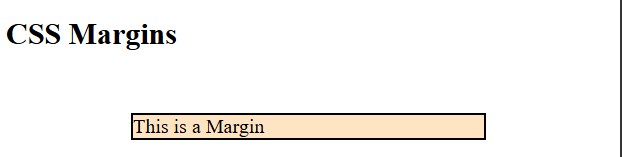
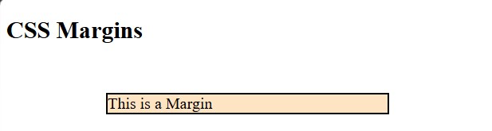
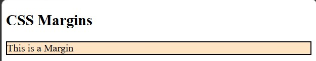
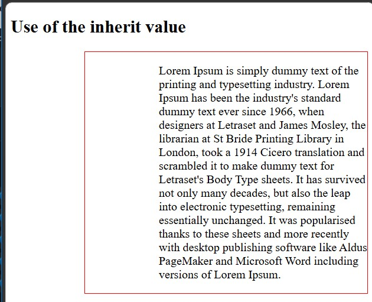
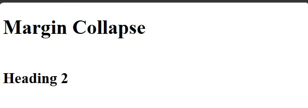

<div align="center">

# 🚀 CSS Learning Portfolio

### Building My Full Stack Development Journey, One Lesson at a Time.


<br><br>

<a href="https://github.com/mr-nexora">

</a>

<a href="https://www.linkedin.com/in/mrnexora/">

</a>

<a href="https://yourportfolio.com">

</a>

</div>

---

# 👋 Welcome

Welcome to my **CSS Learning Repository**.

This repository showcases my journey of learning modern CSS, including layouts, Flexbox, Grid, animations, responsive design, and UI styling. Each lesson contains source code, notes, screenshots, and practical exercises to improve my front-end development skills.

---

# 📂 Repository Overview

| 📌 Information | Details |
|:---------------|:--------|
| 👨‍💻 Author | **T.M.S.U. Thennakoon (Sahan Udara)** |
| 🎓 Program | Computer Science Undergraduate |
| 💻 Technology | CSS3 |
| 📚 Learning Method | Daily Lessons & Hands-on Practice |
| 🎯 Goal | Become a Professional Full Stack Developer |
| 📅 Repository Started | 2026 |

---

# ✨ What's Inside

- 📖 Structured Lessons
- 💻 Source Code
- 📷 Output Screenshots
- 📝 Markdown Notes
- 🚀 Mini Projects
- 📚 Practice Exercises
- 📈 Continuous Progress Updates

---

# 🌍 Connect With Me

<div align="center">

<a href="https://github.com/mr-nexora">

</a>

<a href="https://www.linkedin.com/in/mrnexora/">

</a>

<a href="https://yourportfolio.com">

</a>

</div>

---

# 📚 Learning Resources

This repository is built through continuous practice using educational resources such as:

- W3Schools
- MDN Web Docs
- freeCodeCamp


---

# ⚖️ Copyright

> **© 2026 T.M.S.U. Thennakoon (Sahan Udara). All Rights Reserved.**
>
> This repository has been created for educational, portfolio, and personal learning purposes.
>
> You are welcome to explore the code and learn from it. However, copying, redistributing, or presenting this work as your own without permission is not allowed.

---
<div align="center">

⭐ If you find this repository useful, consider giving it a Star.

Happy Coding! 🚀

</div>

---
# Lesson 10: CSS Margins

CSS margins are used to create space around elements, outside of any defined borders. Margins do not have a background color; they are completely transparent.

---

## 1. Individual Margin Properties

CSS has specific properties for specifying the margin for each side of an element:

- `margin-top`
- `margin-right`
- `margin-bottom`
- `margin-left`

All margin properties can have the following values:

- **length:** Specifies a margin in `px`, `pt`, `cm`, etc.
- **%:** Specifies a margin in % of the width of the containing element.
- **auto:** The browser calculates the margin.
- **inherit:** Specifies that the margin should be inherited from the parent element.

```CSS
    /* test1.html */
    <style>
        p {
            margin-top: 50px;
            margin-right: 100px;
            margin-bottom: 50px;
            margin-left: 100px;
        }
    </style>
```

#### 

---

## 2. Margin - Shorthand Property

To shorten the code, it is possible to specify all the margin properties in one single margin property.

The shorthand syntax accepts 1 to 4 values (Clockwise order: Top, Right, Bottom, Left):

- 4 Values: `margin: 50px 100px 50px 100px;` (Top: 50px, Right: 100px, Bottom: 50px, Left: 100px)

- 3 Values: `margin: 50px 100px 50px;` (Top: 50px, Right & Left: 100px, Bottom: 50px)

- 2 Values: `margin: 50px 100px;` (Top & Bottom: 50px, Right & Left: 100px)

- 1 Value: `margin: 50px;` (All 4 sides: 50px)

```CSS
    /* test2.html */
    <style>
        p {
            margin: 50px 100px 50px 100px;
        }
    </style>
```

#### 

---

## 3. The auto Value

You can set the margin property to `auto` to horizontally center an element within its container. The element will then take up the specified width, and the remaining space will be split equally between the left and right margins.

Requirement: For horizontal centering to work using `margin: auto;`, the element must have a specified `width` property (e.g., `width: 50%;`).

```CSS
    /* test3.html */
    <style>
        p {
            margin: auto;
        }
    </style>
```

#### 

---

## 4. The inherit Value

The `inherit` keyword specifies that a property should inherit its value from its parent element.

In this example, the element with class `.txt` inherits the `margin-left` value specified on its parent container (e.g., a `<div class="container">` that has `margin-left: 100px;`).

```CSS
    /* test4.html */
    <style>
    .txt {
            margin-left: inherit;
        }
    </style>
```

#### 

---

5. CSS Margin CollapseTop and bottom margins of elements are sometimes collapsed into a single margin that is equal to the largest of the two margins. This behavior is known as Margin Collapse.

#### How Margin Collapse Works:

When two vertical margins touch, instead of adding them together ($50\text{px} + 20\text{px} = 70\text{px}$), the browser collapses them into a single margin using the maximum value.

- `h1` has a `margin-bottom` of 50px.
- `h2` has a `margin-top` of 20px.
- Actual calculated space between `h1` and `h2`: 50px (Not $50 + 20 = 70\text{px}$).

```CSS
    /* test5.html */
    <style>
        h1 {
            margin-bottom: 50px;
        }

        h2 {
            margin-top: 20px;
        }
    </style>
```

#### 
