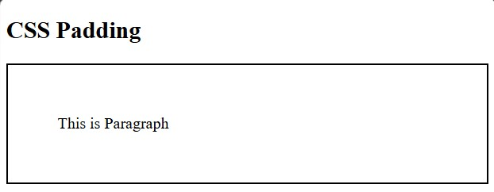
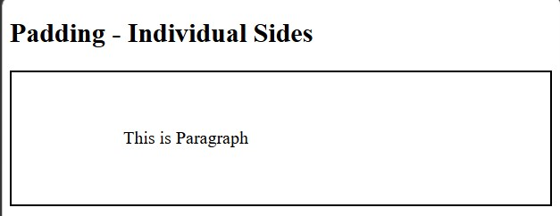
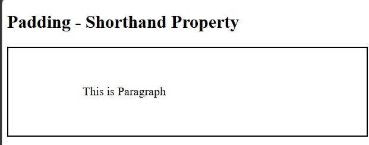
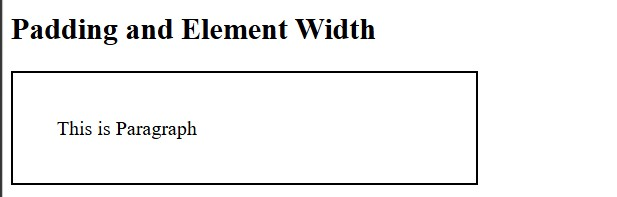
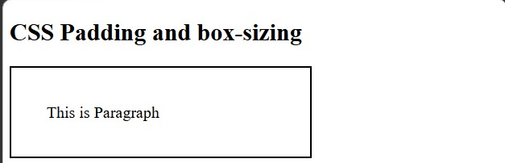

<div align="center">

# 🚀 CSS Learning Portfolio

### Building My Full Stack Development Journey, One Lesson at a Time.


<br><br>

<a href="https://github.com/mr-nexora">

</a>

<a href="https://www.linkedin.com/in/mrnexora/">

</a>

<a href="https://yourportfolio.com">

</a>

</div>

---

# 👋 Welcome

Welcome to my **CSS Learning Repository**.

This repository showcases my journey of learning modern CSS, including layouts, Flexbox, Grid, animations, responsive design, and UI styling. Each lesson contains source code, notes, screenshots, and practical exercises to improve my front-end development skills.

---

# 📂 Repository Overview

| 📌 Information | Details |
|:---------------|:--------|
| 👨‍💻 Author | **T.M.S.U. Thennakoon (Sahan Udara)** |
| 🎓 Program | Computer Science Undergraduate |
| 💻 Technology | CSS3 |
| 📚 Learning Method | Daily Lessons & Hands-on Practice |
| 🎯 Goal | Become a Professional Full Stack Developer |
| 📅 Repository Started | 2026 |

---

# ✨ What's Inside

- 📖 Structured Lessons
- 💻 Source Code
- 📷 Output Screenshots
- 📝 Markdown Notes
- 🚀 Mini Projects
- 📚 Practice Exercises
- 📈 Continuous Progress Updates

---

# 🌍 Connect With Me

<div align="center">

<a href="https://github.com/mr-nexora">

</a>

<a href="https://www.linkedin.com/in/mrnexora/">

</a>

<a href="https://yourportfolio.com">

</a>

</div>

---

# 📚 Learning Resources

This repository is built through continuous practice using educational resources such as:

- W3Schools
- MDN Web Docs
- freeCodeCamp


---

# ⚖️ Copyright

> **© 2026 T.M.S.U. Thennakoon (Sahan Udara). All Rights Reserved.**
>
> This repository has been created for educational, portfolio, and personal learning purposes.
>
> You are welcome to explore the code and learn from it. However, copying, redistributing, or presenting this work as your own without permission is not allowed.

---
<div align="center">

⭐ If you find this repository useful, consider giving it a Star.

Happy Coding! 🚀

</div>

---
# Lesson 11: CSS Padding

CSS padding properties are used to generate space around an element's content, inside of any defined borders. Unlike margins, padding is affected by the element's background color.

---

## 1. CSS Padding Basics

Padding creates inner spacing between the content of an element and its outer border.

```CSS
    /* test1.html */
    <style>
        p {
            border: 2px solid black;
            padding: 50px;
        }
    </style>
```

#### 

---

## 2. Padding - Individual Sides

CSS has specific properties for specifying the padding for each side of an element:

- padding-top
- padding-right
- padding-bottom
- padding-left

Allowed values for padding properties:

- length: Specifies padding in px, pt, cm, etc.
- %: Specifies padding in % of the width of the containing element.
- inherit: Specifies that the padding should be inherited from the parent element.

**Note:** Negative values are not allowed for padding properties (unlike margins).

```CSS
    /* test2.html */
    <style>
        p {
            padding-top: 50px;
            padding-bottom: 50px;
            padding-right: 100px;
            padding-left: 100px;
        }
    </style>
```

#### 

---

## 3. Padding - Shorthand Property

To shorten the code, you can specify all padding properties in one single padding property declaration.

The shorthand syntax accepts 1 to 4 values (Clockwise order: Top, Right, Bottom, Left):

- 4 Values: `padding: 50px 100px 50px 100px;` (Top: 50px, Right: 100px, Bottom: 50px, Left: 100px)
- 3 Values: `padding: 50px 100px 50px;` (Top: 50px, Right & Left: 100px, Bottom: 50px)
- 2 Values: `padding: 50px 100px;` (Top & Bottom: 50px, Right & Left: 100px)
- 1 Value: `padding: 50px;` (All 4 sides: 50px)

```CSS
    /* test3.html */
    <style>
        p {
            padding: 50px 100px 50px 100px;
        }
    </style>
```

#### 

---

## 4. Padding and Element Width

By default in the standard CSS Box Model (`box-sizing: content-box`), setting an element's `width` property defines only the width of the content area.If you add padding to that element, the total rendered width of the element will be:

$$\text{Total Rendered Width} = \text{Width} + \text{Left Padding} + \text{Right Padding} + \text{Borders}$$

In this example, the actual rendered element width on screen will be $300\text{px} + 35\text{px (left)} + 35\text{px (right)} + 4\text{px (borders)} = \mathbf{374\text{px}}$.

```CSS
    /* test4.html */
    <style>
        p{
            border: 2px solid black;
            width: 300px;
            padding: 35px;
        }
    </style>
```

#### 

---

## 5. CSS Padding and box-sizing

To keep the width at $300\text{px}$, no matter how much padding is added, you can use the `box-sizing: border-box;` property.
This forces the browser to include padding and border values inside the specified width, preventing layout breakage and unexpected overflow.

```CSS
    /* test5.html */
    <style>
        p{
            box-sizing: border-box;
        }
    </style>
```

#### 
