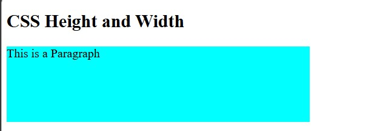
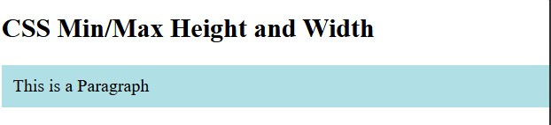

<div align="center">

# 🚀 CSS Learning Portfolio

### Building My Full Stack Development Journey, One Lesson at a Time.


<br><br>

<a href="https://github.com/mr-nexora">

</a>

<a href="https://www.linkedin.com/in/mrnexora/">

</a>

<a href="https://mr-nexora.github.io/mr-nexora-personal-portfolio/">

</a>

</div>

---

# 👋 Welcome

Welcome to my **CSS Learning Repository**.

This repository showcases my journey of learning modern CSS, including layouts, Flexbox, Grid, animations, responsive design, and UI styling. Each lesson contains source code, notes, screenshots, and practical exercises to improve my front-end development skills.

---

# 📂 Repository Overview

| 📌 Information | Details |
|:---------------|:--------|
| 👨‍💻 Author | **T.M.S.U. Thennakoon (Sahan Udara)** |
| 🎓 Program | Computer Science Undergraduate |
| 💻 Technology | CSS3 |
| 📚 Learning Method | Daily Lessons & Hands-on Practice |
| 🎯 Goal | Become a Professional Full Stack Developer |
| 📅 Repository Started | 2026 |

---

# ✨ What's Inside

- 📖 Structured Lessons
- 💻 Source Code
- 📷 Output Screenshots
- 📝 Markdown Notes
- 🚀 Mini Projects
- 📚 Practice Exercises
- 📈 Continuous Progress Updates

---

# 🌍 Connect With Me

<div align="center">

<a href="https://github.com/mr-nexora">

</a>

<a href="https://www.linkedin.com/in/mrnexora/">

</a>

<a href="https://mr-nexora.github.io/mr-nexora-personal-portfolio/">

</a>

</div>

---

# 📚 Learning Resources

This repository is built through continuous practice using educational resources such as:

- W3Schools
- MDN Web Docs
- freeCodeCamp


---

# ⚖️ Copyright

> **© 2026 T.M.S.U. Thennakoon (Sahan Udara). All Rights Reserved.**
>
> This repository has been created for educational, portfolio, and personal learning purposes.
>
> You are welcome to explore the code and learn from it. However, copying, redistributing, or presenting this work as your own without permission is not allowed.

---
<div align="center">

⭐ If you find this repository useful, consider giving it a Star.

Happy Coding! 🚀

</div>

---
# Lesson 12: CSS Height and Width

The CSS `height` and `width` properties are used to set the height and width of an element. The `max-width`, `min-width`, `max-height`, and `min-height` properties offer fine-grained responsive control over dimensions.

---

## 1. CSS Height and Width Basics

The `height` and `width` properties specify the dimensions of the content area of an element (excluding padding, borders, and margins unless `box-sizing: border-box` is used).

### Property Values:

- **`auto`** - Default. The browser calculates height and width based on content.
- **`length`** - Defines height/width in specific units like `px`, `em`, `rem`, `cm`, etc.
- **`%`** - Defines height/width as a percentage of the parent container's dimensions.
- **`initial`** - Sets height/width to its default initial value.
- **`inherit`** - Inherits height/width from its parent element.

```CSS
    /* test1.html */
<style>
        p {
            background-color: aqua;
            width: 400px;
            height: 100px;
        }
    </style>
```

#### 

---

## 2. CSS Min/Max Height and Width

Setting fixed `width` or `height` values can sometimes cause design issues on small screens (like mobile devices) because fixed elements can overflow their container or create unwanted horizontal scrollbars.

Using min/max properties solves this problem by allowing elements to resize dynamically while setting bounds on how large or small they can get.

### I. `max-width` Property

The `max-width` property defines the maximum width an element can reach.

- If the browser window is larger than `900px`, the element's width will stay at `900px`.
- If the browser window shrinks below `900px`, the element automatically scales down to fit the smaller screen size.

```CSS
    /* test2.html */
<style>
    p {
        max-width: 900px;
    }
</style>
```

#### 
