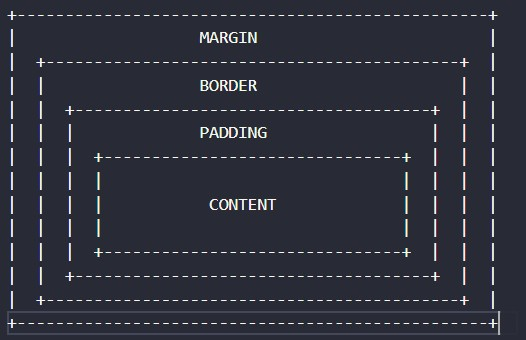
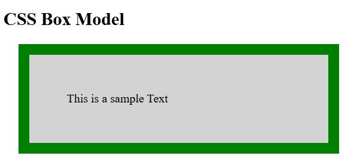

<div align="center">

# 🚀 CSS Learning Portfolio

### Building My Full Stack Development Journey, One Lesson at a Time.


<br><br>

<a href="https://github.com/mr-nexora">

</a>

<a href="https://www.linkedin.com/in/mrnexora/">

</a>

<a href="https://mr-nexora.github.io/mr-nexora-personal-portfolio/">

</a>

</div>

---

# 👋 Welcome

Welcome to my **CSS Learning Repository**.

This repository showcases my journey of learning modern CSS, including layouts, Flexbox, Grid, animations, responsive design, and UI styling. Each lesson contains source code, notes, screenshots, and practical exercises to improve my front-end development skills.

---

# 📂 Repository Overview

| 📌 Information | Details |
|:---------------|:--------|
| 👨‍💻 Author | **T.M.S.U. Thennakoon (Sahan Udara)** |
| 🎓 Program | Computer Science Undergraduate |
| 💻 Technology | CSS3 |
| 📚 Learning Method | Daily Lessons & Hands-on Practice |
| 🎯 Goal | Become a Professional Full Stack Developer |
| 📅 Repository Started | 2026 |

---

# ✨ What's Inside

- 📖 Structured Lessons
- 💻 Source Code
- 📷 Output Screenshots
- 📝 Markdown Notes
- 🚀 Mini Projects
- 📚 Practice Exercises
- 📈 Continuous Progress Updates

---

# 🌍 Connect With Me

<div align="center">

<a href="https://github.com/mr-nexora">

</a>

<a href="https://www.linkedin.com/in/mrnexora/">

</a>

<a href="https://mr-nexora.github.io/mr-nexora-personal-portfolio/">

</a>

</div>

---

# 📚 Learning Resources

This repository is built through continuous practice using educational resources such as:

- W3Schools
- MDN Web Docs
- freeCodeCamp


---

# ⚖️ Copyright

> **© 2026 T.M.S.U. Thennakoon (Sahan Udara). All Rights Reserved.**
>
> This repository has been created for educational, portfolio, and personal learning purposes.
>
> You are welcome to explore the code and learn from it. However, copying, redistributing, or presenting this work as your own without permission is not allowed.

---
<div align="center">

⭐ If you find this repository useful, consider giving it a Star.

Happy Coding! 🚀

</div>

---
# Lesson 13: CSS Box Model

All HTML elements can be considered as boxes. In CSS, the term **"Box Model"** is used when talking about design and layout. It is the core concept that dictates how element dimensions and spacing are calculated across web pages.

---

## 1. What is the CSS Box Model?

The CSS Box Model is essentially a box that wraps around every HTML element. It consists of four distinct layers (from inside out):

1. **Content:** The actual content of the element, where text, images, or child elements appear.
2. **Padding:** Clear area around the content (inside the border). Padding is transparent and inherits the background color of the element.
3. **Border:** A border that goes around the padding and content.
4. **Margin:** Clear area outside the border. Margins separate the element from adjacent elements and are completely transparent.

---

## 2. Visualizing the Box Model



```css
    //test1.html
    <style>
        p {
            background-color: lightgrey;
            width: 300px;
            border: 15px solid green;
            padding: 50px;
            margin: 20px;
        }
    </style>
```



---

## 4. Calculating Element Dimensions

When you set the width and height properties of an element with CSS, by default (box-sizing: content-box), you only set the width and height of the content area.

To calculate the Total Rendered Width and Height of an element on the screen, you must add padding, borders, and margins:

### Math Formula:

$$\text{Total Width} = \text{Width} + \text{Left Padding} + \text{Right Padding} + \text{Left Border} + \text{Right Border} + \text{Left Margin} + \text{Right Margin}$$

$$\text{Total Height} = \text{Height} + \text{Top Padding} + \text{Bottom Padding} + \text{Top Border} + \text{Bottom Border} + \text{Top Margin} + \text{Bottom Margin}$$
